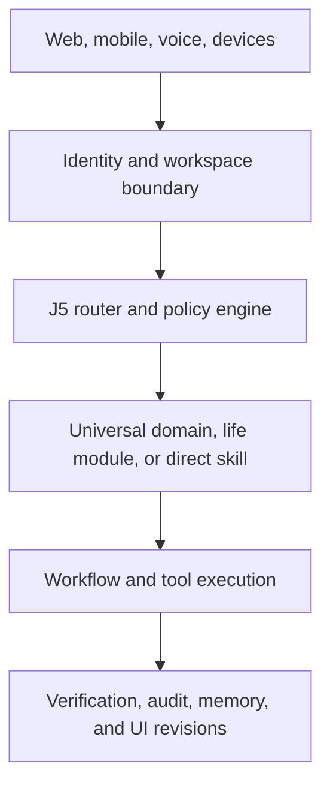
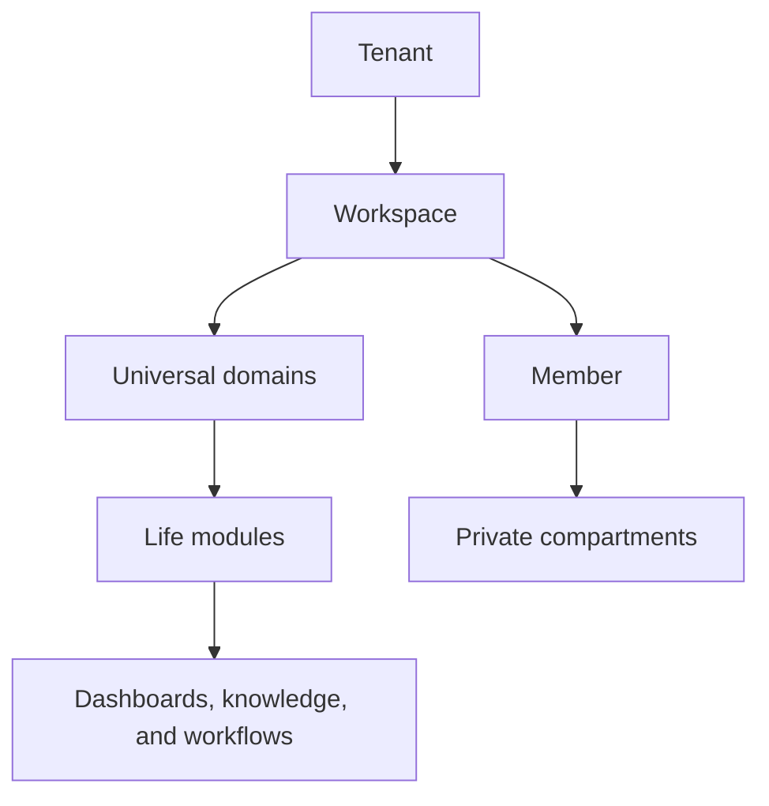

# Target Architecture

## Architectural position

The public version should be a modular platform with one canonical request path. Chat, voice, automations, mobile clients, and devices may enter through different adapters, but they resolve the same user, workspace, policy, context, routing, execution, verification, and memory contracts.

## Logical layers



The Brain Wiki, Knowledge Matrix, life model, and hybrid retrieval service supply governed, cited context to this path. They do not bypass J5 routing or policy evaluation.

## Core services

| Service | Responsibility |
|---|---|
| Identity service | Accounts, sessions, MFA, OAuth identities, devices, recovery |
| Workspace service | Tenant boundary, memberships, roles, policies, settings |
| J5 runtime | Intent classification, direct-skill routing, domain selection, escalation |
| Domain registry | Stable J0-J5 definitions, routing contracts, and display metadata |
| Life Model service | User roles, responsibilities, places, projects, preferences, and module suggestions |
| Module registry | Installed life modules, versions, manifests, cross-domain links, and readiness |
| UI composition service | Component catalog, design recipes, data bindings, actions, dashboard specs, preview, publication, rollback |
| Compartment service | Structured identity, purpose, knowledge, workflows, reflection, collaboration, and IoT context |
| Wiki service | Knowledge spaces, pages, blocks, links, backlinks, revisions, browsing, and corrections |
| Knowledge service | Sources, entities, claims, relations, ontology versions, provenance, and lifecycle |
| Hybrid retrieval service | Permission-filtered lexical, vector, metadata, and graph retrieval with citations |
| Memory service | Session memory, durable facts, summaries, retrieval, citations, retention |
| Capability registry | Skills, tools, connectors, permissions, schemas, readiness, versions |
| Workflow engine | Plans, steps, schedules, retries, idempotency, state, human approvals |
| Provider gateway | Model, speech, search, image, notification, and external-service adapters |
| Policy engine | Risk classification, consent, scopes, budgets, approval requirements |
| Audit service | Immutable action receipts, user-visible activity, support diagnostics |
| Entitlement service | Plans, sponsored access, quotas, metering, feature gates |
| Notification service | In-app, push, email, SMS, and device notifications |

## Canonical execution path

1. Authenticate the actor and resolve `tenantId`, `workspaceId`, `userId`, device, and session.
2. Load policy and the minimum relevant compartment and life-model context.
3. Classify the request using deterministic rules or a small classifier.
4. Route high-confidence requests directly to a registered skill.
5. Route broader work to a universal domain and, when applicable, an installed life module.
6. Retrieve only authorized wiki, vector, and graph context and preserve citations.
7. Spawn specialized workers only when the plan needs them.
8. Evaluate every tool, connector, data-binding, and dashboard action against permissions, risk, budget, and approval rules.
9. Execute idempotently and record an action receipt.
10. Verify the outcome at the depth required by the risk class.
11. Propose memory, graph, life-module, or dashboard updates; persist only changes allowed by policy and approval state.

## Agent hierarchy

The five-tier model remains available, but it is sparse rather than mandatory:

| Tier | Public role | Activation rule |
|---|---|---|
| 1 | J5 orchestrator | Always present as routing and synthesis control |
| 2 | Universal domain container | Used when a request belongs to a life domain or needs domain policy |
| 3 | Executive/planner | Used for multi-step or multi-worker plans |
| 4 | Manager/coordinator | Used for parallel tasks or repeated operational work |
| 5 | Task worker | Used for one bounded skill or tool operation |

Life modules supply configuration, knowledge, workflows, and interface projections inside this hierarchy; they do not require a permanently running agent. Knowledge-graph construction and dashboard-generation workflows are bounded capabilities, not competing hierarchies.

## Data ownership hierarchy



A personal account may have one tenant and one workspace, but the data model must not assume that forever.

## Suggested implementation shape

Use a pnpm monorepo with clear boundaries rather than carrying the complete private layout forward:

```text
apps/
  web/
  api/
  worker/
  mobile/              # later
packages/
  contracts/
  identity/
  j5-runtime/
  domain-sdk/
  life-model/
  ui-composition/      # catalogs, recipes, specs, bindings, render contracts
  compartments/
  knowledge/           # wiki, provenance, graph model, retrieval contracts
  memory/
  capabilities/
  workflows/
  policies/
  providers/
  observability/
docs/
```

The exact framework choices can reuse proven source components, but packages should be extracted only after contracts and tenancy tests exist.
