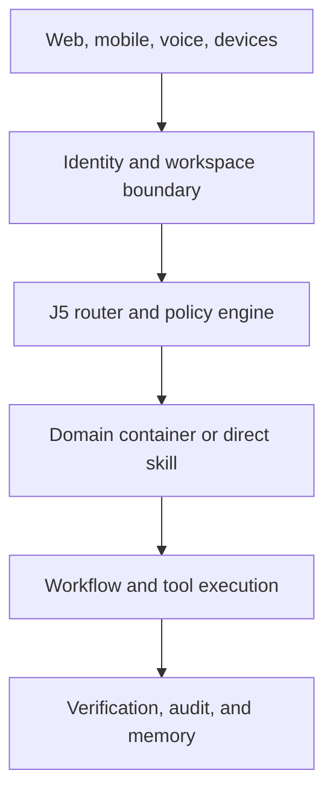
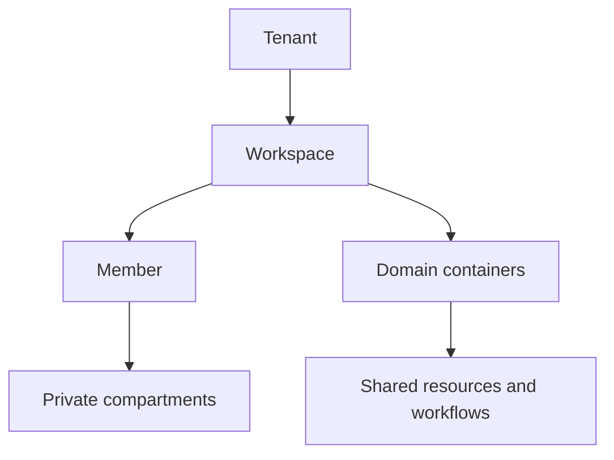

# Target Architecture

## Architectural position

The public version should be a modular platform with one canonical request path. Chat, voice, automations, mobile clients, and devices may enter through different adapters, but they resolve the same user, workspace, policy, context, routing, execution, verification, and memory contracts.

## Logical layers



## Core services

| Service | Responsibility |
|---|---|
| Identity service | Accounts, sessions, MFA, OAuth identities, devices, recovery |
| Workspace service | Tenant boundary, memberships, roles, policies, settings |
| J5 runtime | Intent classification, direct-skill routing, domain selection, escalation |
| Domain registry | Installed domain packs, container slots, prompts, capabilities, UI metadata |
| Compartment service | Structured identity, purpose, knowledge, workflows, reflection, collaboration, and IoT context |
| Memory service | Session memory, durable facts, summaries, retrieval, citations, retention |
| Capability registry | Skills, tools, connectors, permissions, schemas, readiness, versions |
| Workflow engine | Plans, steps, schedules, retries, idempotency, state, human approvals |
| Provider gateway | Model, speech, search, image, notification, and external-service adapters |
| Policy engine | Risk classification, consent, scopes, budgets, approval requirements |
| Audit service | Immutable action receipts, user-visible activity, support diagnostics |
| Entitlement service | Plans, sponsored access, quotas, metering, feature gates |
| Notification service | In-app, push, email, SMS, and device notifications |

## Canonical execution path

1. Authenticate the actor and resolve `tenantId`, `workspaceId`, `userId`, device, and session.
2. Load policy and the minimum relevant compartment context.
3. Classify the request using deterministic rules or a small classifier.
4. Route high-confidence requests directly to a registered skill.
5. Route broader work to one domain container.
6. Spawn specialized workers only when the plan needs them.
7. Evaluate every tool call against permissions, risk, budget, and approval rules.
8. Execute idempotently and record an action receipt.
9. Verify the outcome at the depth required by the risk class.
10. Propose memory updates; persist only information allowed by the user's memory policy.

## Agent hierarchy

The five-tier model remains available, but it is sparse rather than mandatory:

| Tier | Public role | Activation rule |
|---|---|---|
| 1 | J5 orchestrator | Always present as routing and synthesis control |
| 2 | Domain container | Used when a request belongs to a domain or needs domain policy |
| 3 | Executive/planner | Used for multi-step or multi-worker plans |
| 4 | Manager/coordinator | Used for parallel tasks or repeated operational work |
| 5 | Task worker | Used for one bounded skill or tool operation |

Simple requests should usually execute through Tier 1 to a direct skill or Tier 2. Full five-tier execution is reserved for complex, cross-domain work.

## Data ownership hierarchy



A personal account may have one tenant and one workspace, but the data model must not assume that forever.

## Suggested implementation shape

Use a pnpm monorepo with clear boundaries rather than carrying the complete private layout forward:

```text
apps/
  web/
  api/
  worker/
  mobile/              # later
packages/
  contracts/
  identity/
  j5-runtime/
  domain-sdk/
  compartments/
  memory/
  capabilities/
  workflows/
  policies/
  providers/
  observability/
docs/
```

The exact framework choices can reuse proven source components, but packages should be extracted only after contracts and tenancy tests exist.
