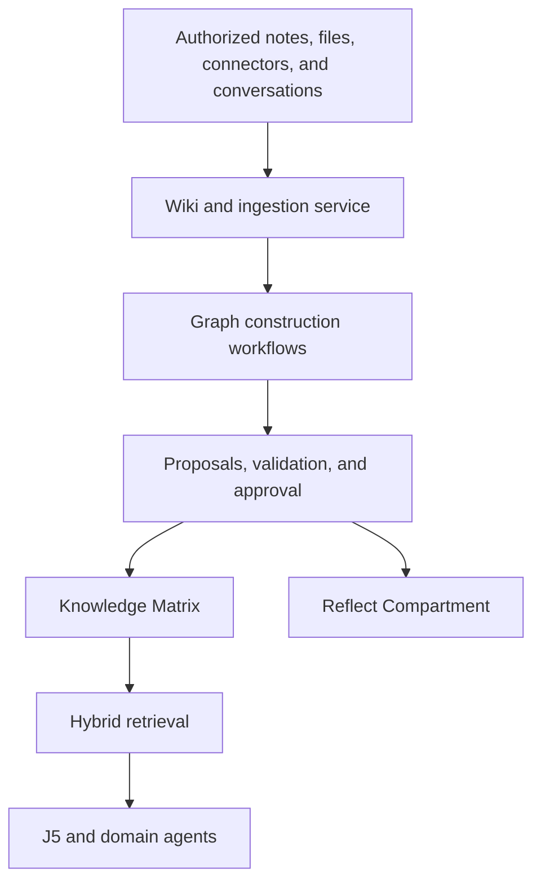

# Second-Brain Wiki and Agentic Knowledge Graph

## Decision

The J5 harness will provide a human-readable wiki backed by a governed Knowledge Matrix and a permission-aware knowledge graph.

These are related layers, not interchangeable names:

1. **second-brain wiki** is the user-facing place to write, browse, organize, link, and correct knowledge.
2. **Knowledge Matrix** is the authoritative service for user-owned knowledge, claims, sources, and governance.
3. **Knowledge graph** represents typed entities, claims, and relationships derived from approved sources.
4. **Hybrid retrieval** combines text, vector, metadata, and graph traversal to supply cited context to J5.
5. **Reflect Compartment** exposes uncertain, disputed, or consequential proposed changes for user review.

The graph is not an orchestrator or a second harness. J5 remains the top-level runtime boundary and invokes graph workflows as governed capabilities; its user-facing assistant surface performs final synthesis.

## Research basis

Andrej Karpathy's [LLM Wiki idea](https://gist.github.com/karpathy/442a6bf555914893e9891c11519de94f) defines the second-brain pattern: preserve raw sources, then let an LLM incrementally compile and maintain interlinked Markdown knowledge rather than reconstructing the same synthesis from raw chunks for every question. [Astro-Han/karpathy-llm-wiki](https://github.com/Astro-Han/karpathy-llm-wiki) is an unofficial MIT-licensed implementation of that idea; it is not Karpathy's official product repository.

The [original RAG paper](https://arxiv.org/abs/2005.11401) remains the basis for dense external retrieval. J5 uses RAG and the wiki as complementary layers rather than treating either as the complete memory system.

DeepLearning.AI and Neo4j's 2025 course [Agentic Knowledge Graph Construction](https://www.deeplearning.ai/courses/agentic-knowledge-graph-construction/) presents a conversational coordinator with three specialist workflows: structured-data graph construction, unstructured-data graph construction, and GraphRAG retrieval. J5 should adopt this separation of concerns while adding tenant isolation, provenance, approval, deletion, and compartment policies required for a public personal-assistant product.

This architecture also follows two important principles:

- GraphRAG is a retrieval pattern, not the entire memory system. See the [Microsoft GraphRAG project](https://github.com/microsoft/graphrag).
- Every derived assertion needs traceable provenance. The model should be compatible with the concepts in the [W3C PROV-O recommendation](https://www.w3.org/TR/prov-o/), even if the MVP uses a simpler application schema.

## Logical architecture

## Layer responsibilities

| Layer | Responsibility | Not responsible for |
|---|---|---|
| second-brain wiki | Pages, blocks, links, revisions, browsing, backlinks, graph views, corrections | Acting as an independent truth store |
| Knowledge Matrix | Authoritative sources, entities, claims, relations, access rules, lifecycle, provenance | Rendering the full user experience |
| Graph construction workflows | Extracting and proposing entities, claims, links, and ontology extensions | Silently declaring uncertain output to be true |
| Hybrid retrieval | Keyword, vector, metadata, and relationship retrieval with citations | Bypassing access control or retention policies |
| Vector Trigger Layer | Matching requests and events to relevant knowledge or workflows | Serving as an authorization layer |
| Reflect Compartment | Reviewing disputed or consequential proposals | Automatically rewriting identity, purpose, or policy |

## Second-brain wiki experience

The wiki should behave like the visible second brain. A user can:

- create pages manually or from templates;
- organize pages into private and shared spaces;
- use blocks for text, lists, tables, tasks, embeds, and references;
- link pages with wiki links and view backlinks;
- inspect related people, projects, goals, decisions, events, documents, and concepts;
- view page history and restore earlier revisions;
- see the source behind a fact or relationship;
- correct, reject, merge, or mark knowledge as outdated;
- inspect proposed knowledge awaiting review;
- move approved knowledge between hot, warm, and cold memory policies;
- export pages and their cited source metadata.

The initial experience should emphasize pages, search, and backlinks. Advanced graph visualization belongs behind an optional view and must not replace normal navigation.

## Knowledge model

A page is not automatically a fact. The model separates source material, extracted assertions, and accepted knowledge.

### Core records

| Record | Purpose |
|---|---|
| `knowledge_space` | Private or shared boundary inside a workspace |
| `knowledge_source` | Original note, file, connector object, conversation selection, URL, or user entry |
| `wiki_page` | Current human-readable page identity and metadata |
| `wiki_revision` | Immutable version of page content |
| `evidence_chunk` | Addressable source segment used for retrieval and citation |
| `knowledge_entity` | Person, organization, project, goal, task, event, document, concept, device, workflow, or domain extension |
| `knowledge_claim` | An assertion about one or more entities with status, confidence, time, and provenance |
| `knowledge_relation` | A typed edge connecting entities or claims |
| `ontology_version` | Versioned definitions of allowed types, fields, and relationships |
| `graph_proposal` | Proposed create, merge, split, update, dispute, or supersede operation |
| `retrieval_receipt` | Records which sources and relationships were supplied to a response or workflow |

### Required ownership and provenance

Every record must include the appropriate ownership boundary:

- `tenantId`;
- `workspaceId`;
- `spaceId`;
- `ownerUserId` or explicit shared-access policy;
- sensitivity and retention classes;
- creation actor and timestamps.

Every derived claim or relation must also preserve:

- source and evidence identifiers;
- source location, range, or content hash;
- extraction method and model or workflow version;
- confidence and validation results;
- temporal validity when known;
- approval state;
- supersession and dispute history.

### Knowledge states

Use explicit lifecycle states rather than a single boolean truth flag:

- `proposed`;
- `accepted`;
- `disputed`;
- `superseded`;
- `deleted`.

User-authored statements may be accepted as statements the user made, but that does not prove an external claim is objectively correct. The provenance model must retain that distinction.

## Agentic graph construction

J5 invokes a bounded knowledge-intake coordinator when authorized content should enter the brain. The coordinator selects one or more specialist workflows.

### 1. Structured-data workflow

For CSV, JSON, databases, APIs, calendars, task systems, and other schema-bearing inputs:

1. inspect the source schema;
2. map fields to the current ontology;
3. detect identifiers and ownership;
4. propose entities and relations;
5. validate types, constraints, duplicates, and references;
6. write only accepted or policy-authorized changes.

### 2. Unstructured-data workflow

For wiki pages, documents, transcripts, email selections, images with extracted text, and web captures:

1. parse and preserve the original source;
2. segment it into citeable evidence;
3. identify candidate entities, claims, dates, and relationships;
4. resolve candidates against existing entities;
5. score confidence and detect contradictions;
6. submit proposed graph changes for policy evaluation or review.

### 3. GraphRAG retrieval workflow

For questions that require relational context:

1. resolve the workspace, actor, and effective access policy;
2. identify entities and the retrieval objective;
3. combine lexical, vector, metadata, and bounded graph traversal;
4. rank evidence rather than returning raw neighboring nodes;
5. construct a cited context package;
6. record a retrieval receipt;
7. return the package to J5 for synthesis.

### Supporting deterministic stages

Ontology validation, entity deduplication, access filtering, source hashing, schema validation, and deletion propagation should be implemented as deterministic services wherever possible. They do not need to be autonomous agents.

## Ontology strategy

J5 needs a small stable core ontology plus extensions contributed by domain packs.

### Core entity types

- Person
- Organization
- Role
- Project
- Goal
- Task
- Event
- Decision
- Document
- Concept
- Place
- Device
- Workflow
- Connector
- Domain

### Core relationship examples

- `MEMBER_OF`
- `HAS_ROLE`
- `WORKS_ON`
- `SUPPORTS_GOAL`
- `DEPENDS_ON`
- `BLOCKED_BY`
- `RELATED_TO`
- `MENTIONED_IN`
- `DECIDED_IN`
- `SCHEDULED_FOR`
- `ASSIGNED_TO`
- `TRIGGERED_BY`
- `CONNECTED_TO`
- `SUPERSEDES`

Domain packs may register additional namespaced entity and relationship types. Ontology changes must be versioned and reversible. Extraction workflows may propose a new type but cannot silently change the ontology.

## Relationship to compartments

| Compartment | Wiki and graph relationship |
|---|---|
| Soul Matrix | May link to approved preferences and identity claims; sensitive changes require review |
| Purpose Matrix | Connects roles, goals, projects, decisions, and commitments |
| Workflow Matrix | Connects capabilities, routines, triggers, approvals, and execution history |
| IoT Matrix | Connects authorized devices, rooms, interfaces, and capabilities |
| Collaboration Matrix | Connects people, groups, organizations, shared spaces, and responsibilities |
| Knowledge Matrix | Owns wiki sources, entities, claims, relations, provenance, and retrieval |
| Self-Reflecting Matrix | Generates improvement observations as proposals, not accepted facts |
| Reflect Compartment | Reviews corrections, conflicts, identity changes, ontology changes, and sensitive proposals |

The wiki is primarily a surface over the Knowledge Matrix, but it may link to records governed by other compartments without copying them.

## Memory and graph lifecycle

- **Hot:** temporary entities and relations used during the active conversation or workflow.
- **Warm:** project-scoped summaries, open questions, unresolved entities, and recent working knowledge.
- **Cold:** user-approved durable pages, entities, claims, goals, and source records.

Promotion to durable knowledge follows compartment policy. Deletion must propagate to chunks, embeddings, graph projections, caches, and derived summaries. Audit receipts may retain minimal non-content metadata when required by policy.

## Storage strategy

The MVP should keep PostgreSQL as the transactional source of truth and use:

- relational tables for pages, sources, entities, claims, relations, proposals, and permissions;
- object storage for original files and large artifacts;
- full-text indexes for lexical search;
- `pgvector` or an equivalent workspace-filtered vector index;
- indexed adjacency tables for bounded graph traversal.

Define a `GraphStore` interface from the beginning. A native graph database such as Neo4j may later serve as a rebuildable projection when profiling shows that multi-hop traversal, graph algorithms, or scale justify the additional operational system.

Do not dual-write authoritative knowledge independently to PostgreSQL and a graph database. Publish accepted changes through an outbox/event stream and rebuild graph projections from authoritative records.

## Security requirements

- Apply access control before vector search or graph traversal.
- Never create cross-workspace edges.
- Propagate page- and source-level visibility to chunks, entities, claims, and relations.
- Treat embeddings as derived sensitive data.
- Encrypt connector credentials separately and never store them as graph properties.
- Require explicit approval for derived health, financial, legal, precise-location, identity, or relationship assertions.
- Do not ingest an entire connector account when the user authorized only selected folders or objects.
- Record which knowledge supported consequential recommendations or actions.
- Support export, correction, revocation, and deletion across every derived layer.

## MVP implementation slices

### Slice A — Wiki foundation

- spaces, pages, blocks, revisions, links, backlinks;
- permissions, sensitivity, retention, export, and deletion;
- full-text search and source citations.

### Slice B — Governed ingestion

- source registry and evidence chunks;
- structured and unstructured intake workflows;
- core ontology, entity resolution, graph proposals, and review queue.

### Slice C — Hybrid retrieval

- workspace-filtered lexical and vector search;
- bounded relationship traversal;
- cited context packages and retrieval receipts;
- integration with J5's canonical request path.

### Slice D — Maintenance and visualization

- contradiction and stale-knowledge detection;
- ontology proposals and versioning;
- graph explorer;
- native graph projection only if supported by measured need.

## Explicit non-goals for the first release

- autonomous ingestion of all email, files, browsing history, or device data;
- cross-user or cross-tenant graph inference;
- silent changes to Soul, Purpose, security, or autonomy policies;
- treating model confidence as proof;
- unlimited recursive graph expansion;
- autonomous web crawling as a default memory source;
- requiring a separate graph database before the core model and isolation tests are proven.
