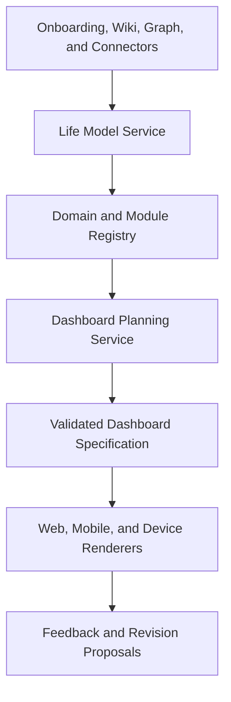

# Adaptive Domains and Generative Dashboard Architecture

## Decision

J5 will personalize the product through stable universal domains, installable life modules, and governed dashboard specifications.

The public architecture uses three levels:

1. **Universal domains** provide a predictable structure that applies broadly across users.
2. **Life modules** represent the user's actual roles, responsibilities, spaces, projects, interests, businesses, and equipment.
3. **Generated dashboards** are versioned declarative specifications assembled from a controlled component, data-binding, action, and design catalog.

J5 may create or revise a dashboard when the user asks, but it must not generate arbitrary production JavaScript, HTML, CSS, SQL, or action handlers at runtime.

## Finding from the private J5 reference system

The private J5 system already demonstrates the value of domain-specific interfaces:

- J1 Health, J2 Business and Finance, J3 Security, and J4 Lifestyle have defined dashboard concepts;
- domain wiki scans compile current domain data into assistant context;
- specialized interfaces such as the Garage and Invention Lab combine devices, projects, artifacts, status, and controls.

The reusable lesson is the experience pattern, not the hard-coded implementation. The public product needs a general system that can create equally useful interfaces for a different person's garden, classroom, rental properties, music studio, caregiving responsibilities, vehicles, or other life structures.

## Universal domain shells

J0 remains the platform-control agent and J5 remains the AI/agent harness. J1-J4 become stable human-life domain agents broad enough for most users.

| Identifier | Universal responsibility | Example modules |
|---|---|---|
| J0 | Platform and administration | account, permissions, integrations, devices, data controls |
| J1 | Health and wellbeing | fitness, nutrition, sleep, medical organization, mental wellness |
| J2 | Work, money, and projects | employment, businesses, finances, school, creator work, inventions |
| J3 | Safety, security, and resilience | privacy, digital security, insurance, emergency plans, risk |
| J4 | Home, relationships, and lifestyle | household, family, travel, hobbies, garden, vehicles, personal routines |
| J5 | AI/agent harness | runtime orchestration, context and memory, policy, tools, workflow state, verification, observability, actions, and user-facing delivery |

These categories are semantic anchors, not fixed menu contents. A user may choose friendly display labels, but the stable identifiers and routing meaning remain intact.

## Life modules

A life module is a user-owned installation inside one primary domain with optional links to other domains.

Examples include:

- Maker Garage;
- Small Business;
- Job Search;
- College Semester;
- Family Caregiving;
- Home Garden;
- Rental Properties;
- Music Studio;
- Vehicle Maintenance;
- Youth Sports;
- Research Lab.

A module can contribute:

- workspace pages and navigation;
- wiki templates and graph ontology extensions;
- data-source and connector requirements;
- skills and workflows;
- dashboard templates and design recipes;
- registered widgets and actions;
- onboarding questions;
- permission, sensitivity, and retention defaults.

### Example: Maker Garage

A Maker Garage may have J4 as its primary home because it represents a physical personal space and hobby. It may link to:

- J2 for invention projects, costs, intellectual-property work, or products;
- J3 for equipment safety and network security;
- J0 for printers, robotic arms, sensors, HoloMap displays, and integration health.

The user sees one coherent Garage interface. Internal cross-domain relationships do not require duplicate dashboards or duplicate data.

## Life model discovery

J5 builds a user-specific life model from explicit, reviewable inputs.

### Initial onboarding

Ask short questions about:

- roles: employee, founder, student, caregiver, parent, creator, retiree;
- responsibilities: health, household, finances, dependents, teams, properties;
- active projects and goals;
- places and spaces: home, office, workshop, garden, classroom;
- equipment and devices;
- recurring routines;
- authorized services and data sources;
- accessibility, density, and interaction preferences.

Onboarding should produce a useful starting configuration without demanding a complete autobiography.

### Continuous discovery

Later conversations, wiki additions, connectors, and graph relationships may indicate that a new module would help. J5 can propose:

> You now have three printers, two invention projects, and recurring maintenance tasks. Would you like a Maker Garage workspace and dashboard?

A proposal is not an installation. The user reviews its scope, data sources, permissions, navigation changes, and dashboard preview before publishing it.

## Architecture



## Core services

| Service | Responsibility |
|---|---|
| Life Model service | Roles, responsibilities, places, projects, preferences, module suggestions |
| Domain registry | Stable J0-J5 definitions and routing contracts |
| Module registry | Installed module manifests, versions, cross-domain links, readiness |
| Component catalog | Approved visual components and their typed properties |
| Design recipe registry | Layout, hierarchy, density, color, typography, and responsive rules |
| Data-binding registry | Approved view-model queries and typed result contracts |
| Action registry | Capability-backed user actions with risk and approval policies |
| Dashboard planner | Converts user intent and authorized context into a dashboard plan |
| Spec validator | Schema, catalog, accessibility, data-readiness, policy, and cost validation |
| Dashboard renderer | Renders valid specs using product-owned components |
| Revision service | Drafts, previews, publishes, rolls back, compares, and archives specs |
| Experience evaluator | Detects empty, overloaded, inaccessible, stale, or unused dashboards |

## Declarative dashboard contract

A generated dashboard is stored as a `DashboardSpec`, not as source code.

```ts
interface DashboardSpec {
  schemaVersion: string;
  id: string;
  tenantId: string;
  workspaceId: string;
  ownerUserId: string;
  domainId: "j0" | "j1" | "j2" | "j3" | "j4";
  moduleInstallationId?: string;
  title: string;
  intent: string;
  designRecipeId: string;
  designRecipeVersion: string;
  catalogVersion: string;
  layout: ResponsiveLayout;
  elements: Record<string, DashboardElement>;
  bindings: DataBindingRef[];
  actions: ActionRef[];
  createdFrom: DashboardProvenance;
  status: "draft" | "published" | "superseded" | "archived";
}
```

A specification may reference only registered identifiers. It must not contain:

- arbitrary executable code;
- raw SQL;
- unrestricted URLs;
- inline authentication data;
- unregistered API routes;
- arbitrary CSS;
- unrestricted HTML;
- prompts that execute when the page opens.

## Component catalog

Quality comes from a strong design system and composition rules, not from asking a model to invent every screen.

### Layout components

- PageHeader
- Section
- ResponsiveGrid
- Stack
- SplitPanel
- Tabs
- Drawer
- DetailPanel
- EmptyState

### Information components

- MetricCard
- StatusCard
- ProgressCard
- AlertPanel
- ActivityFeed
- Timeline
- TaskList
- Calendar
- DataTable
- Chart
- KnowledgeCard
- DocumentList
- ContactCard
- ProjectCard
- DeviceCard
- MediaGallery
- MapView

### Interaction components

- FilterBar
- SearchBox
- QuickActionBar
- ApprovalCard
- Form
- Checklist
- CommandInput
- RefreshControl

Each component definition includes typed properties, accessibility requirements, supported breakpoints, density limits, permitted children, binding shapes, loading/error/empty states, and interaction events.

## Design recipes

A component catalog prevents unsafe output, but it does not guarantee good UX. J5 also needs curated design recipes.

Examples:

- daily command center;
- health review;
- project operations;
- financial overview;
- device control room;
- creative studio;
- technical workbench;
- household organizer;
- learning progress;
- incident response.

A recipe defines:

- information hierarchy;
- recommended components;
- maximum cards per section;
- grid behavior by breakpoint;
- primary and secondary actions;
- color and status semantics;
- typography scale;
- empty and onboarding states;
- accessibility and reduced-motion behavior.

The model selects and fills a recipe before it invents a new arrangement. Novel layouts remain possible, but only inside catalog and validation constraints.

## Data binding

Dashboards bind to approved view models, not directly to databases or connectors.

Example binding:

```json
{
  "bindingId": "garage.printers.overview",
  "queryId": "devices.printers.overview.v1",
  "params": { "moduleInstallationId": "module_123" },
  "refreshPolicy": "on-focus"
}
```

The data-binding registry defines:

- input schema;
- output schema;
- authorization rule;
- sensitivity class;
- cache and refresh behavior;
- empty, stale, and unavailable states;
- supported visual components.

J5 cannot place a widget unless its required binding is available or the preview clearly marks it as a setup placeholder. The public product must never display fabricated metrics to make a generated dashboard look complete.

## Actions and approvals

Every interactive control maps to a registered capability.

Examples:

- `tasks.create`;
- `calendar.event.create`;
- `wiki.page.open`;
- `device.printer.pause`;
- `workflow.run`;
- `connector.configure`.

The renderer emits an action request. J5's policy engine resolves identity, scope, risk, budget, and approval requirements before execution. A dashboard button cannot call a connector directly.

## Dashboard creation lifecycle

1. The user requests a dashboard or approves a J5 suggestion.
2. J5 resolves the target domain, module, goal, device, and audience.
3. The planner loads the authorized life model, module manifest, catalog, recipes, binding availability, and action policies.
4. The model generates a typed draft specification.
5. Deterministic validators reject unknown components, invalid layouts, unsafe actions, inaccessible output, and unavailable bindings.
6. J5 renders a preview with real data, safe sample data, or clearly labeled setup placeholders.
7. The user publishes, requests changes, or discards the draft.
8. Publication creates an immutable revision and optionally adds navigation.
9. Usage and explicit feedback may create revision proposals; J5 does not silently rearrange stable dashboards.

## Command examples

J5 should support requests such as:

- "Create a dashboard for my garden."
- "Add printer maintenance to my Garage dashboard."
- "Make my health page easier to read on my phone."
- "Build a weekly view for my job search."
- "Remove the trading panel and keep only account monitoring."
- "Show the same travel dashboard on the kitchen display."
- "Roll back the Garage page to yesterday's version."

The underlying capabilities are:

- `dashboard.propose`;
- `dashboard.preview`;
- `dashboard.revise`;
- `dashboard.publish`;
- `dashboard.rollback`;
- `dashboard.archive`;
- `dashboard.assign-surface`.

## Surface adaptation

The same life module can have different specifications or projections for:

- desktop web;
- mobile;
- tablet or smart display;
- watch;
- voice-only interaction;
- accessibility-focused modes.

Surface adaptation changes presentation and interaction density, not authorization. A watch view may expose status and a few safe actions while the desktop dashboard exposes analysis and configuration.

## Technology recommendation

### Preferred MVP stack

| Concern | Recommended direction | Reason |
|---|---|---|
| Declarative generative UI | [Vercel Labs json-render](https://github.com/vercel-labs/json-render) behind J5-owned contracts | Catalog-constrained, schema-validated, progressive JSON rendering; React and React Native support |
| Model interaction and streaming | [Vercel AI SDK](https://ai-sdk.dev/docs) provider-neutral structured output and tool calling | Fits the planned provider gateway and React client |
| AI conversation surfaces | [AI Elements](https://ai-sdk.dev/elements) selectively for messages, tools, citations, previews, and approvals | Handles streaming AI-specific interface states |
| Schemas | Zod plus versioned JSON Schema exports | Runtime validation and TypeScript inference |
| Web design system | Product-owned shadcn/ui and Radix-based components with Tailwind design tokens | Accessible primitives with full source control |
| Server data | TanStack Query against registered view-model APIs | Cache, stale-state, retry, and mutation handling |
| Charts and tables | Recharts and TanStack Table wrapped inside J5 catalog components | Mature primitives without exposing raw configuration to the model |
| Persistent state | PostgreSQL dashboard, module, catalog, and revision records | Matches the product's canonical transactional store |
| Portable UI protocol | [Google A2UI](https://developers.googleblog.com/introducing-a2ui-an-open-project-for-agent-driven-interfaces/) compatibility later | Useful cross-platform declarative standard, but not required for the MVP |
| Agent-to-frontend events | [AG-UI](https://github.com/ag-ui-protocol/ag-ui) evaluation later | Useful if J5 exposes external agent runtimes; unnecessary for the first internal runtime |

The product should wrap json-render behind J5 contracts. Its library-specific JSON must not become the permanent database contract without a compatibility layer and migration strategy.

### Why not runtime code generation

Generating React code for each user would introduce:

- build and deployment requirements;
- dependency and supply-chain risk;
- inconsistent accessibility and design;
- security review problems;
- difficult mobile portability;
- broken dashboards after library upgrades;
- no reliable rollback boundary.

Declarative specs provide personalization without turning every user request into a software deployment.

## Required records

- `life_profiles`;
- `life_roles`;
- `life_spaces`;
- `module_definitions`;
- `module_installations`;
- `module_domain_links`;
- `component_catalog_versions`;
- `design_recipe_versions`;
- `data_binding_definitions`;
- `action_definitions`;
- `dashboard_specs`;
- `dashboard_revisions`;
- `dashboard_surface_assignments`;
- `dashboard_feedback`;
- `dashboard_generation_receipts`.

All records require tenant and workspace ownership. Generated specs and bindings must be included in export and deletion flows.

## Quality gates

A generated dashboard cannot be published unless it passes:

- schema validation;
- ownership and authorization validation;
- catalog and version validation;
- data-binding readiness;
- action-policy validation;
- responsive checks at supported breakpoints;
- keyboard and screen-reader checks;
- contrast and reduced-motion requirements;
- loading, empty, stale, error, and offline states;
- content-density limits;
- visual regression tests for reusable recipes;
- truthful capability-status checks.

## MVP boundary

The first implementation should support:

- stable universal J-domain shells;
- explicit installation of life modules;
- onboarding-generated module suggestions;
- a curated component catalog;
- 4-6 design recipes;
- versioned dashboard drafts and previews;
- publish, revise, rollback, and archive;
- web-responsive rendering;
- read widgets plus low-risk capability-backed actions.

Defer:

- arbitrary user-authored component code;
- public third-party component marketplaces;
- autonomous navigation restructuring;
- silent layout optimization;
- native graph-driven UI mutation without approval;
- cross-device custom renderers beyond responsive web until the web contracts stabilize.
