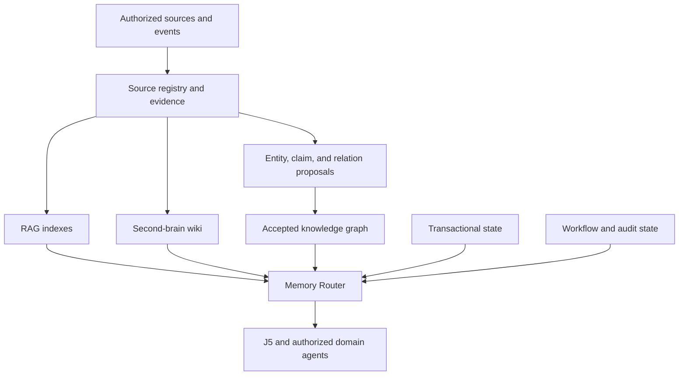

# J5 Harness Memory and Workflow Architecture

**Status:** Architecture proposal  
**Date:** 2026-09-16  
**Applies to:** J5 PA Public open-source core and managed product

## Terminology and identity

J5 is the AI/agent harness: the software infrastructure and runtime scaffolding that wraps around one or more LLMs and agents to turn model reasoning into reliable, multi-step real-world actions. J0-J4 are stable system/domain agents operating inside the harness. The wiki is a memory method used by the harness; it is not named "J5 Wiki" and it is not an orchestrator.

This document uses **second-brain wiki** for the LLM-maintained wiki pattern and **knowledge graph** for typed entities, claims, and relationships.

## Harness boundary

J5 owns model/provider access, context assembly, memory routing, agent and tool invocation, workflow state, capability permissions, approvals, retries, verification, audit, observability, and delivery of responses or actions. Its orchestration engine is one subsystem inside the harness. A user-facing assistant persona is an interface hosted by J5, not the definition of J5 itself.

## Research basis and attribution

- Andrej Karpathy published the original [LLM Wiki idea](https://gist.github.com/karpathy/442a6bf555914893e9891c11519de94f) on April 4, 2026. It describes an LLM-maintained, interlinked set of Markdown files that compiles raw sources into durable knowledge. It is an idea and pattern, not a complete product repository.
- [Astro-Han/karpathy-llm-wiki](https://github.com/Astro-Han/karpathy-llm-wiki) is an unofficial MIT-licensed Agent Skills implementation of that pattern. The private J5 system currently vendors this implementation.
- The [original RAG paper](https://arxiv.org/abs/2005.11401) combines model parameters with an external dense-vector index so generation can use retrieved evidence.
- DeepLearning.AI and Neo4j's [Agentic Knowledge Graph Construction](https://www.deeplearning.ai/courses/agentic-knowledge-graph-construction/) course, introduced by Andrew Ng and taught by Andreas Kollegger, separates conversational coordination, structured-data graph construction, unstructured-data graph construction, and GraphRAG retrieval.
- Microsoft's [GraphRAG](https://microsoft.github.io/graphrag/) extracts entities, relationships, and claims, builds graph communities and summaries, and supports local, global, DRIFT, and baseline vector-search query modes.
- [LangGraph](https://docs.langchain.com/oss/javascript/langgraph/overview) is a low-level runtime for long-running, stateful orchestration with durable execution and human-in-the-loop controls. LangChain supplies higher-level model, tool, retriever, and agent abstractions; neither is automatically required by every J5 workflow.

## Decision

J5 will not choose one memory method. It will use a **federated memory architecture** with one policy-aware Memory Router over several specialized stores.

1. Transactional records hold current authoritative state.
2. Source and evidence records preserve what was actually observed.
3. RAG retrieves semantically relevant source passages.
4. The second-brain wiki compiles durable human-readable understanding.
5. The knowledge graph represents explicit relationships and supports multi-hop questions.
6. Workflow state stores active execution, checkpoints, approvals, and resumability.
7. An event/audit log records what J5 and the domain agents did.

No derived layer becomes authoritative merely because an LLM created it.

## Why the methods are complementary

| Method | Best at | Advantages | Constraints and failure modes | J5 role |
|---|---|---|---|---|
| Relational/transactional state | Exact current records, permissions, tasks, schedules, billing, device state | Deterministic queries, constraints, transactions, updates, deletion | Weak for fuzzy discovery and free-form synthesis; schema evolution is deliberate | System of record for operational facts |
| Evidence store | Immutable or versioned source material and citeable segments | Preserves provenance, supports reprocessing, makes derived stores rebuildable | Storage and retention cost; source access may be revoked; raw content can be noisy | Ground truth for what was ingested |
| RAG / hybrid retrieval | Finding relevant passages across large unstructured collections | Fast broad recall, incremental indexing, useful citations, mature tooling | Chunking loses context; similarity is not truth; embedding drift; weak global and multi-hop reasoning; stale or unauthorized chunks can leak if filtering is late | Default evidence discovery path |
| Second-brain wiki | Persistent summaries, concepts, decisions, cross-links, evolving project/domain briefs | Human-readable, portable, inspectable, editable, versionable, compounding synthesis | Ingestion and maintenance cost; synthesis may flatten nuance or introduce errors; taxonomy and cross-links drift; write conflicts; plain grep eventually loses recall | Durable understanding and user-facing knowledge surface |
| Knowledge graph / GraphRAG | Relationships, entity neighborhoods, dependency chains, contradictions, whole-corpus themes | Explicit semantics, bounded multi-hop traversal, relationship explainability, useful local/global query modes | Entity resolution and ontology design are hard; extraction is expensive and probabilistic; graph bloat; temporal facts and deletion require care; native graph infrastructure adds operations | Relationship and multi-hop reasoning path |
| Workflow state | Active plans, node outputs, retries, checkpoints, approvals, resumable threads | Precise execution status and recovery | Not a knowledge base; retaining every checkpoint increases cost and privacy exposure | Operational memory for ongoing work |
| Event and audit log | Historical actions, receipts, outcomes, policy decisions | Append-oriented traceability, debugging, accountability | Logs are not current state; sensitive payloads require minimization and retention limits | Episodic record of system behavior |

## Memory topology



The source/evidence layer is the common spine. RAG indexes, wiki articles, and graph projections are derived from it and can be rebuilt. Transactional records remain authoritative for current operational facts.

## Canonical records

The exact schema may evolve, but these identities must remain distinct:

| Record | Meaning |
|---|---|
| `knowledge_source` | Original note, file, URL capture, selected connector object, conversation selection, or direct user entry |
| `source_revision` | A version or snapshot of a mutable source |
| `evidence_chunk` | Addressable segment with source offsets or anchors, content hash, visibility, sensitivity, and retention metadata |
| `embedding_projection` | Rebuildable vector representation tied to an embedding model/version |
| `wiki_page` | Stable human-readable topic identity |
| `wiki_revision` | Immutable compiled or user-edited page version with cited evidence |
| `knowledge_entity` | Canonical person, organization, project, goal, task, event, concept, place, device, workflow, or module entity |
| `knowledge_claim` | A time-aware assertion with evidence, state, and provenance |
| `knowledge_relation` | A typed, time-aware edge supported by one or more claims or source records |
| `graph_proposal` | Candidate create, merge, split, update, dispute, or supersede operation |
| `workflow_run` | Execution identity and versioned state for a direct, deterministic, queued, or LangGraph workflow |
| `action_receipt` | Actor, policy decision, capability, parameters summary, result, and audit metadata |
| `retrieval_receipt` | The authorized evidence, wiki revisions, records, and graph paths supplied to a response |

Every durable record is scoped by tenant, workspace, visibility, sensitivity, retention, and actor. Derived content also carries the model, prompt/workflow, ontology, parser, and source versions that produced it.

## Ingestion and knowledge-compilation path

1. Resolve the actor, workspace, consent, source scope, and retention policy.
2. Register the source and preserve a versioned original or a revocable reference.
3. Parse and segment the source into citeable evidence.
4. Publish an outbox event for rebuildable projections.
5. Update lexical and vector indexes.
6. Determine whether the source merits wiki compilation, graph extraction, both, or neither.
7. Compile wiki proposals that preserve citations and distinguish source facts from synthesis.
8. Extract entity, claim, and relation proposals with confidence and temporal scope.
9. Run deterministic validation, entity resolution, duplication, ontology, access, and contradiction checks.
10. Accept low-risk changes allowed by policy; send sensitive, disputed, identity-changing, or consequential proposals to the Reflect Compartment.
11. Publish accepted changes and invalidate affected summaries, caches, dashboards, and graph projections.

The system must never independently dual-write authoritative knowledge to multiple databases. Accepted changes originate in one authoritative knowledge service and flow to search and graph projections through events.

## Memory Router

The Memory Router plans retrieval; it does not generate the final answer. It receives the authenticated context, intent, domain/module scope, sensitivity, latency budget, and cost budget.

| Question or task | Primary path | Optional supporting path |
|---|---|---|
| "What is on my calendar tomorrow?" | Transactional calendar/tool query | Relevant purpose or travel constraints |
| "Find the document where we discussed warranty terms" | Lexical/vector RAG | Wiki topic page |
| "What have I learned about this project?" | Second-brain wiki | RAG evidence for verification |
| "How are this vendor, project, deadline, and blocked task connected?" | Knowledge graph | Transactional task state and RAG evidence |
| "What is this workflow doing right now?" | Workflow state/checkpoint | Action receipts |
| "Why did J5 make this recommendation?" | Retrieval and action receipts | Cited source, wiki revision, and graph path |
| "What changed since last week?" | Temporal records and event log | Wiki/graph change summaries |

Retrieval order:

1. Apply authorization and source visibility before search or traversal.
2. Select one or more bounded retrieval modes.
3. Retrieve candidates with provenance.
4. Rerank for relevance, recency, authority, and task fit.
5. Detect contradictions and missing evidence.
6. Package cited context under a token and cost budget.
7. Record a retrieval receipt when policy requires traceability.

## Wiki operating model

The second-brain wiki follows Karpathy's compilation idea while adding product governance.

- **Raw/evidence layer:** immutable or versioned source material.
- **Compiled layer:** linked topic, entity, project, decision, and synthesis pages.
- **Operations:** ingest, query, lint, review, export, correct, supersede, and delete.
- **Human role:** authorize and curate sources, inspect important claims, ask questions, correct errors, and approve consequential changes.
- **LLM role:** summarize, organize, cross-link, identify contradictions, propose updates, and maintain indexes.

Public-product additions beyond the idea-file pattern:

- workspace and private-space isolation;
- revision-safe concurrent writes;
- evidence-backed diffs and correction controls;
- deletion propagation;
- source revocation and retraction;
- model/workflow versioning;
- asynchronous ingestion with durable jobs;
- optional vector search when the curated wiki grows beyond reliable lexical navigation;
- structured export to portable Markdown plus provenance metadata.

Wiki pages are readable views, not undisputed truth. User edits, source-backed statements, and model synthesis must remain distinguishable.

## Knowledge-graph operating model

The DeepLearning.AI/Neo4j course pattern fits inside J5 as four bounded responsibilities:

| Responsibility | J5 implementation |
|---|---|
| Conversational coordinator | Memory Router and knowledge-intake coordinator, invoked by J5 |
| Structured-data workflow | Deterministic schema inspection plus agent-assisted mapping and validation |
| Unstructured-data workflow | Evidence parsing plus agent-assisted entity/claim/relation proposals |
| GraphRAG workflow | Permission-filtered local, global, or bounded traversal that returns cited context to J5 |

The graph should begin as relational entity/claim/relation tables with indexed adjacency. Define a `GraphStore` interface and add a native graph database only after profiling proves a need for deeper traversal, graph algorithms, or scale. A native graph store remains a rebuildable projection.

## J5 harness and workflow model

J5 is the top-level AI/agent harness and runtime boundary. Its orchestration subsystem coordinates J0-J4, which are stable domain agents with domain responsibility, policy, and a registry of capabilities and workflows. Managers and workers are spawned for bounded tasks rather than treated as permanently running personalities.

| Agent | Stable responsibility |
|---|---|
| J0 | Platform control, integrations, permissions, reliability, audit, support |
| J1 | Health and wellbeing |
| J2 | Work, money, and projects |
| J3 | Safety, security, and resilience |
| J4 | Home, relationships, and lifestyle |
| J5 | AI/agent harness: models, context, memory, routing, workflows, tools, policy, verification, observability, and action/response delivery |

Life modules such as Maker Garage, caregiving, travel, a specific business, or creator work configure the stable domain agents. They supply tools, workflows, ontology extensions, dashboards, and knowledge views; they do not require additional always-on top-level agents.

## Workflow execution modes

Do not place every capability in LangGraph. Each workflow declares one execution mode.

| Mode | Use when | Examples |
|---|---|---|
| `direct` | One bounded read or low-risk action with no meaningful intermediate state | Fetch weather, read a record, create a simple note |
| `deterministic` | Fixed, auditable steps with explicit validation and no model-controlled loop | Validate a dashboard spec, synchronize a selected source, calculate a report |
| `queued` | Predictable background work needs retries, concurrency limits, scheduling, or cancellation | File parsing, embedding, wiki recompilation, connector sync, notification delivery |
| `langgraph` | State depends on model observations and requires branching, loops, checkpoints, handoffs, or human interruption | Multi-source research, agentic graph construction, complex planning, sensitive action plans, cross-agent coordination |

### LangGraph qualification test

Use LangGraph only when at least one strong condition is present and its value exceeds the added complexity:

- model-directed branching or iterative tool use;
- long-running work that must resume after failure;
- human approval or correction in the middle of execution;
- multiple domain-agent/worker handoffs with shared versioned state;
- parallel branches that must join and reconcile;
- bounded reflection/replanning loops;
- replayable, inspectable state transitions are required for safety or support.

Do not use LangGraph for ordinary CRUD, a single model call, a simple tool call, fixed validation pipelines, conventional scheduled ETL, or retries that a normal job queue already handles.

LangChain components may be used for provider, tool, document, and retriever integrations without forcing the workflow into LangGraph. LangGraph may also be used without LangChain.

## Workflow manifest

Every registered workflow should declare:

```yaml
id: j2.project.research-brief
version: 1.0.0
owner: j2
executionMode: langgraph
stateSchemaVersion: 1
riskClass: moderate
allowedCapabilities: [knowledge.read, web.search, wiki.propose]
memoryReadPolicy: project-scoped
memoryWritePolicy: proposal-only
checkpointPolicy: durable
approvalNodes: [publish]
timeoutSeconds: 1800
maxSteps: 30
retryPolicy: bounded
costBudget: configurable
```

Manifests make execution choice, permissions, memory behavior, risk, and cost visible before a workflow runs.

## Memory temperatures

| Temperature | Contents | Promotion rule |
|---|---|---|
| Hot | Current messages, tool results, temporary plan and graph state | Expires with the task unless explicitly summarized |
| Warm | Active project summaries, recent decisions, unresolved questions, workflow checkpoints | Time- or project-bounded; periodically compacted and reviewed |
| Cold | Accepted durable records, approved wiki revisions, sources, claims, relations, preferences, and configuration | Requires policy-authorized write with provenance |

Workflow checkpoints are operational state even when retained for a long time; they do not silently become knowledge. Knowledge promotion is a separate decision.

## Evolution, updates, and constraints

### Version everything that changes meaning

- schema and state-schema versions;
- ontology and relationship-type versions;
- parser and chunking versions;
- embedding model and dimensionality;
- prompt, agent, and workflow versions;
- wiki compiler conventions;
- retrieval and reranking policy;
- dashboard and life-module manifests.

### Rebuildable projections

Embeddings, search indexes, graph database projections, community summaries, caches, and generated dashboards must be reproducible from authoritative records and versioned source evidence.

### Temporal and truth controls

- Model facts as claims with `validFrom`, `validTo`, `observedAt`, and supersession where relevant.
- Preserve contradictions instead of overwriting history.
- Separate "the user said X" from "X is externally verified."
- Never translate confidence scores into proof.
- Use source authority, recency, corroboration, and user acceptance as separate signals.

### Maintenance loops

- Wiki lint: broken links, orphans, duplicate topics, unsupported statements, stale summaries.
- RAG evaluation: retrieval recall, citation accuracy, access-control tests, stale-index checks.
- Graph evaluation: entity-resolution precision, orphan and duplicate nodes, unsupported edges, path quality.
- Workflow evaluation: completion, correction, retry, approval, latency, and cost rates by version.
- Deletion verification: sources, chunks, embeddings, wiki revisions, graph projections, caches, and derived summaries.

Updates should be incremental by default, with shadow rebuilds and version swaps for major parser, embedding, ontology, or graph changes.

## Open-source core and managed product boundary

The architecture should avoid a crippled community edition. Keep the durable formats and provider interfaces portable.

| Open-source core | Managed/metered service |
|---|---|
| J5 harness, domain-agent contracts, and router | Managed deployment, scaling, backups, and upgrades |
| Domain, life-module, workflow, and dashboard SDKs | Hosted connector operations and multi-device sync |
| Local relational, Markdown wiki, vector, and graph adapters | Managed databases, indexes, queues, and graph projections |
| Memory Router and retrieval contracts | Provider gateway, usage metering, budgets, and billing |
| Import/export, provenance, corrections, and deletion | Team/family administration, support tooling, and service observability |
| Local/self-hosted workflows and LangGraph adapters | Managed long-running executions and operational SLAs |
| Test suites for isolation and portable data | Hosted security operations and compliance features |

Entitlements must live outside the knowledge format. Users must be able to export their sources, wiki, graph claims/relations, workflow definitions, and dashboard specifications without reverse-engineering hosted internals.

The project still needs a separate license and contribution-governance decision. Apache-2.0, AGPL, and an open-core model create materially different incentives and should not be chosen accidentally.

## Delivery sequence

1. Establish source/evidence, ownership, provenance, and deletion contracts.
2. Implement permission-filtered lexical/vector retrieval and retrieval receipts.
3. Productize the second-brain wiki with revisions, citations, lint, and review.
4. Add entity/claim/relation proposals and bounded graph traversal.
5. Add the workflow registry and execution-mode decision contract.
6. Use LangGraph first for agentic graph construction and one complex cross-agent workflow.
7. Evaluate quality, cost, latency, and user correction rates before expanding graph or agent complexity.
8. Add a native graph database only after measured requirements justify it.

## Non-negotiable safeguards

- Authorization happens before retrieval, traversal, and tool execution.
- Embeddings, summaries, checkpoints, and graph edges are sensitive derived data.
- Health, financial, legal, precise-location, identity, and relationship inferences require stricter policy and review.
- Every consequential answer or action can expose its supporting sources and receipts.
- Users can inspect, correct, dispute, supersede, export, and delete durable memory.
- J5 is the runtime boundary for cross-domain orchestration; memory subsystems and graph agents never bypass its policy, capability, verification, or audit controls.

