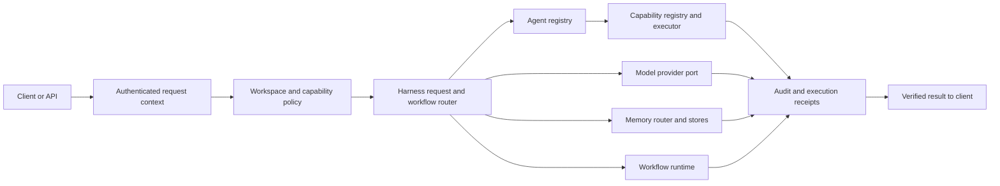

# J5 Harness Architecture

**Status:** Public product baseline
**Date:** 2026-09-30

## Product definition

J5 is the AI agent harness: the software runtime around one or more models and agents that
turns model reasoning into controlled, multi-step work. Orchestration is one part of J5.
Chat, voice, mobile, desktop, and dashboards are clients of the harness; they do not define
the harness itself.

J5 owns the boundaries for:

- request and actor context;
- model/provider access and context assembly;
- agent, capability, and workflow registration;
- authorization, risk policy, and approvals;
- execution state, checkpoints, retry, cancellation, and idempotency;
- memory retrieval and provenance;
- verification, audit, tracing, and result delivery.

## System shape

Every adapter is supplied by the host or a configured J5 package. A missing provider, store,
capability handler, or workflow runtime is an explicit configuration or execution error. The
system must report the failing integration and must not invent simulated results or reroute
silently.

## Package responsibilities

### `@j5/harness-contracts`

Defines portable TypeScript contracts for actors, requests, manifests, providers, policy,
capabilities, memory stores, retrieval receipts, and workflow runtimes. It has no runtime
provider, database, filesystem, or identity defaults.

### `@j5/harness-core`

Composes registries and injected ports. At startup it rejects duplicate or incomplete
registrations and checks workflow references against registered agents and capabilities.
At execution time it asks policy before invoking a capability and delegates durable workflow
operations to the configured runtime. The core does not implement database, model, or queue
behavior.

### Future adapter and application packages

Provider, memory, durable-runtime, observability, API/SDK, and control-plane packages will
implement these ports. Each adapter must declare its configuration, scopes, supported
operations, and observable error behavior. A web control plane will be a client of the API
and will use the same workspace authorization boundary.

## Identity and workspace isolation

Reusable code always receives an explicit `ActorContext` and `RequestContext`. The host
establishes authenticated actor, tenant, and workspace IDs. Packages never infer an operator,
create a default user, or widen a query when scope is missing. Authorization runs before
memory retrieval or capability execution. Every run, receipt, and event stays correlated to
request and trace IDs.

Cross-workspace access is denied by default. Any sharing across workspaces must be an
explicit grant represented by the host's policy layer. Registries and manifests describe
available work; they do not grant permission to execute it.

## Agents, capabilities, and workflows

An agent manifest describes identity, domain, and declared capability IDs. A capability
manifest describes versioned input/output schemas, permissions, risk, and supported execution
modes. A workflow manifest declares:

- owner and semantic version;
- input, output, and checkpoint state schema versions;
- allowed capabilities and memory scopes;
- memory write policy and risk class;
- approval requirements;
- timeout, attempt limit, idempotency, maximum steps, and cost budget;
- checkpoint and trace retention.

A manifest is not proof that implementation exists or is ready. Startup must reject missing
handlers, inconsistent references, unsupported execution modes, duplicate IDs, and invalid
limits.

Execution modes are explicit:

| Mode | Intended use |
| --- | --- |
| `direct` | One bounded read or write, or a simple capability call |
| `deterministic` | Fixed validation, transformation, or rendering |
| `queued` | Predictable long-running work that needs durable retries |
| `graph` | Branching, resumable workflows with model decisions or human interruption |

Use durable graph orchestration only when branching, checkpoints, human review, or multi-agent
reconciliation requires it. CRUD, one model call, fixed ETL, and simple retries should use a
simpler mode.

## Policy, approval, and action safety

Policy evaluates the explicit actor, workspace, capability, risk, and request before execution.
A denied action remains denied. An approval-required action must enter an approval process;
it must not be treated as approved or executed while waiting. Approval, cancellation, retry,
and completion produce correlated audit events. Verification is a distinct step from model
output: consequential actions return their actual result and verification evidence.

## Memory and evidence

J5 treats operational records, source evidence, approved synthesis, derived projections, and
workflow checkpoints as different authorities. Retrieved context includes workspace scope,
source revision, freshness, and citations where available. RAG similarity, graph extraction,
and generated summaries do not by themselves establish truth.

The Memory Router will apply access policy first, choose bounded sources, retrieve evidence,
identify freshness or conflicts, and emit a retrieval receipt. Current operational facts come
from their authoritative service. Derived indexes, wiki pages, and graph projections must be
rebuildable and support correction and deletion propagation.

Storage ports remain independent: `EvidenceStore`, `WikiStore`, `VectorStore`, and
`GraphStore` are adapters, not a single universal memory database. PostgreSQL adjacency is a
reasonable first graph implementation; a separate graph database requires measured need.

## Observability and receipts

Requests, provider calls, capability executions, memory retrievals, workflow transitions,
approvals, verification results, and delivered actions share request and trace correlation.
Receipts record which sources or capabilities participated, policy version, and outcome
metadata without unnecessarily copying secret or private content into logs.

## Portability and privacy

The public project defines portable contracts and host-independent orchestration. Product
consumers supply their own identity, secrets, providers, connectors, data, and deployment
configuration through explicit adapters. No personal assistant data, private paths, account
IDs, credentials, device configuration, or private repository history belongs in this repo.

## Current implementation boundary

The contracts and core packages are early foundations. They do not yet constitute a complete
production runtime: approval persistence, provider adapters, memory routing, durable workflow
execution, API, UI, and deployment are roadmap items. See the
[implementation roadmap](IMPLEMENTATION_ROADMAP.md).
