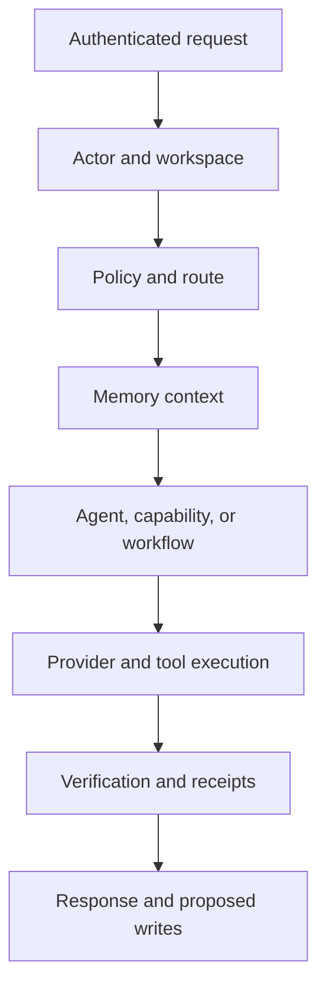

# J5 Public Implementation Blueprint

**Status:** Implementation-ready planning  
**Date:** 2026-09-16  
**Depends on:** [Target Architecture](../architecture/01-target-architecture.md) and [J5 Harness Memory and Workflow Architecture](../architecture/05-j5-harness-memory-and-workflow-architecture.md)

## Objective

Build the public J5 product as an AI/agent harness rather than copying the private application. The first implementation must prove the complete harness path with one narrow capability before adding a large agent tree, connector catalog, graph database, generative dashboards, or device runtime.

The first useful path is:

> An authenticated user asks J5 a question about an authorized project note; the harness selects J2, retrieves cited evidence, calls a model through a provider adapter, returns a cited answer, and records retrieval and action receipts.

This vertical slice validates identity, workspace scope, harness routing, a domain agent, memory policy, evidence retrieval, provider abstraction, verification, audit, and response delivery without requiring every planned subsystem.

## Reuse decision from the personal system

Reuse concepts and compatible contracts from the private J5 system, not its codebase wholesale.

| Private-system capability | Public decision |
|---|---|
| pnpm TypeScript workspace | Reuse as the monorepo foundation |
| Fastify backend patterns | Reuse after tenant, policy, and error-contract review |
| Prisma/PostgreSQL | Reuse with tenant/workspace-first schema design |
| Zod skill schemas | Generalize into versioned public contracts |
| React UI patterns | Rebuild against the public design system and product navigation |
| BullMQ/Redis | Use for durable queued work, not as agent knowledge memory |
| Domain semantics | Preserve stable J1-J4 meanings; remove private content |
| Capability/function registry | Rebuild as a manifest-driven executable registry |
| Canonical runtime | Decompose into harness services; do not port as one large service |
| Local second-brain wiki | Implement behind `EvidenceStore` and `WikiStore` adapters |
| Chroma/vector fallback | Prefer PostgreSQL full text plus `pgvector` for the public baseline |
| Local-user fallback | Prohibited in every public runtime path |

## Proposed repository shape

```text
apps/
  web/                       # public site, onboarding, command center, settings
  api/                       # authenticated HTTP and streaming entry points
  worker/                    # queued ingestion, indexing, wiki, notification jobs
packages/
  contracts/                 # Zod schemas and TypeScript types
  harness-core/              # canonical turn pipeline and ports
  identity/                  # actor/workspace resolution and authorization contracts
  domain-agents/             # J0-J4 definitions and agent registry
  memory/                    # Memory Router and storage/retrieval ports
  workflows/                 # manifests and runtime selection
  capabilities/              # tool/skill registry and policy metadata
  policies/                  # risk, approval, budget, autonomy rules
  providers/                 # LLM and later speech/search provider adapters
  knowledge/                 # evidence, wiki, claim, relation, and graph contracts
  audit/                     # action and retrieval receipts
  ui-catalog/                # later: dashboard component and design recipes
  test-kit/                  # synthetic tenant fixtures and conformance suites
docs/
```

Packages expose ports and contracts. Applications compose them. Domain agents must not import database, provider, queue, or connector implementations directly.

## Technology baseline

This baseline minimizes extraction friction while establishing clean public boundaries.

| Layer | Baseline | Reason |
|---|---|---|
| Workspace | pnpm monorepo, TypeScript strict mode | Matches the proven private stack and supports shared contracts |
| Web | React with a product-owned design system; framework decision isolated in `apps/web` | Keeps domain/runtime packages framework-independent |
| API | Fastify | Proven in the private system; strong schema/plugin model |
| Contracts | Zod plus generated OpenAPI where appropriate | Runtime validation and one shared contract source |
| Database | PostgreSQL with Prisma | Transactional integrity and existing operational experience |
| Search | PostgreSQL full text plus `pgvector` | One authoritative operational system for MVP; workspace-filtered retrieval |
| Object storage | S3-compatible adapter | Portable source/artifact storage |
| Queue | BullMQ/Redis behind `JobQueue` | Existing experience and durable worker separation |
| Complex agents | LangGraph behind `AgentWorkflowRuntime` | Used only for qualifying stateful/branching workflows |
| Testing | unit, contract, integration, tenant-isolation, and Playwright end-to-end suites | Architecture is not accepted without isolation and deletion tests |
| Observability | OpenTelemetry-compatible traces, structured logs, metrics, receipts | Avoids coupling the harness contract to one vendor |

### Deferred technology decisions

- exact web framework and hosting topology;
- authentication vendor versus first-party implementation;
- hosted object-storage provider;
- managed Redis provider;
- model-provider launch list and bring-your-own-key policy;
- native graph database;
- mobile framework and device runtimes;
- final open-source license and contribution governance.

None of these should block the contracts and harness-kernel slices.

## Harness services

| Service/port | Responsibility |
|---|---|
| `ActorResolver` | Resolve authenticated user, tenant, workspace, session, device, and roles |
| `HarnessTurnService` | Execute the canonical request lifecycle |
| `DomainAgentRegistry` | Resolve J0-J4 agent definitions and policies |
| `IntentRouter` | Select direct capability, domain agent, or workflow |
| `MemoryRouter` | Plan authorized retrieval and return cited context packages |
| `CapabilityRegistry` | Register typed skills/tools and readiness |
| `PolicyEngine` | Evaluate access, risk, autonomy, approvals, and budgets |
| `WorkflowRegistry` | Resolve versioned workflow manifests |
| `WorkflowRuntimeSelector` | Select direct, deterministic, queued, or LangGraph execution |
| `ProviderGateway` | Invoke models through normalized, budget-aware adapters |
| `Verifier` | Apply schema, evidence, policy, and outcome checks |
| `ReceiptStore` | Persist retrieval and action receipts |
| `EventPublisher` | Publish accepted changes for derived projections and workers |

## Canonical turn contract



Rules:

1. No unresolved actor or workspace enters the harness.
2. Policy evaluation precedes memory retrieval and capability exposure.
3. Agents receive only the capabilities and context authorized for that turn.
4. Model output cannot directly execute a tool; it produces a typed capability request.
5. Writes use idempotency keys and explicit approval state.
6. Verification precedes success delivery.
7. Durable memory writes are proposals unless policy explicitly permits automatic acceptance.
8. Every consequential response/action can point to its evidence and receipts.

## First vertical slice

### User story

As a workspace member, I can add a project note and ask J5 what that note says about a deadline. J5 routes the question through the J2 domain agent, retrieves only my workspace's evidence, answers with a citation, and records why that evidence was used.

### Included

- synthetic account, tenant, workspace, membership, and session fixtures;
- authenticated `POST /v1/harness/turn` contract;
- J2 domain-agent definition;
- one `knowledge.read` capability;
- note/source and evidence-chunk records;
- lexical retrieval, with vector retrieval behind a disabled feature flag initially;
- mock provider adapter plus one configurable real provider adapter;
- retrieval receipt and turn/action receipt;
- streaming-compatible response envelope;
- error codes for authentication, authorization, no evidence, provider failure, budget, and verification failure;
- integration test proving two workspaces cannot retrieve each other's note.

### Excluded

- autonomous memory writes;
- graph construction;
- wiki compilation;
- LangGraph;
- connector ingestion;
- dashboard generation;
- voice, watch, mobile, or IoT;
- billing beyond a usage-event contract.

### Acceptance criteria

- A request without `tenantId`, `workspaceId`, and authenticated actor context is rejected.
- Repository/service queries require workspace scope as an argument.
- Pre-retrieval authorization is tested, including adversarial cross-workspace fixtures.
- The J2 agent cannot access an unregistered capability.
- The response includes source/evidence identifiers and a user-safe citation.
- Provider failures do not create accepted memory or successful action receipts.
- Logs and traces exclude source bodies, secrets, and raw model prompts by default.
- The same idempotency key cannot create duplicate receipts or writes.
- Export and deletion behavior is specified for every stored record in the slice.

## Contract implementation order

1. Identity and scope: `ActorContext`, `WorkspaceContext`, `RequestContext`.
2. Harness envelope: `HarnessTurnRequest`, `HarnessTurnResponse`, `HarnessError`.
3. Registry: `DomainAgentManifest`, `CapabilityManifest`, `WorkflowManifest`.
4. Policy: `RiskClass`, `ApprovalRequirement`, `PolicyDecision`, `Budget`.
5. Memory: `MemoryQuery`, `ContextPackage`, `ContextItem`, `Citation`.
6. Knowledge: `KnowledgeSource`, `SourceRevision`, `EvidenceChunk`.
7. Execution: `CapabilityRequest`, `CapabilityResult`, `WorkflowRun`.
8. Receipts: `RetrievalReceipt`, `ActionReceipt`, `UsageEvent`.

Schemas use explicit version fields and reject unknown versions at service boundaries.

## Pull-request sequence

| PR | Deliverable | Gate |
|---|---|---|
| 0 | Workspace scaffold, formatting, linting, type checking, CI | Clean install and deterministic checks |
| 1 | `contracts`, `test-kit`, identity/workspace fixtures | Schema tests and no default-user path |
| 2 | Harness core ports and canonical turn skeleton using mocks | Turn lifecycle contract tests |
| 3 | PostgreSQL/Prisma identity, evidence, and receipt adapters | Migration, isolation, export, deletion tests |
| 4 | J2 definition, policy engine minimum, lexical Memory Router | Cross-workspace retrieval test |
| 5 | Provider gateway and cited-answer vertical slice | End-to-end acceptance scenario |
| 6 | Worker, queue adapter, vector projection, rebuild command | Idempotent indexing and deletion propagation |
| 7 | Web onboarding, project-note UI, J5 conversation surface | Playwright user journey and accessibility |

Graph, wiki compilation, LangGraph, generative dashboards, connectors, and billing follow as independent slices after this path is stable.

## Workstreams after the first slice

### Memory and knowledge

Add vector retrieval, second-brain wiki compilation, entity/claim/relation proposals, bounded graph traversal, conflict review, and correction UX.

### Workflow runtime

Add queued workflows first. Add LangGraph for agentic graph construction only after manifests, checkpoints, interruption, and approval contracts exist.

### Adaptive domains and dashboards

Add life-model onboarding, module registry, UI catalog, design recipes, declarative specs, preview, publication, rollback, and visual/accessibility tests.

### Commercial product

Add entitlements, usage events, quotas, provider budgets, billing, sponsored access, support access, and managed operations without changing portable knowledge formats.

### Open-source readiness

Choose a license, publish contribution and security policies, separate optional hosted adapters, document local deployment, add synthetic examples, and scan history before making the repository public.

## Definition of done for a slice

A slice is complete only when it has:

- typed and versioned input/output contracts;
- tenant/workspace authorization tests;
- success, rejection, retry, cancellation, and idempotency behavior as applicable;
- trace and receipt behavior;
- provider/tool budgets where applicable;
- export, correction, and deletion behavior;
- user-visible capability/readiness status;
- documentation and migration notes;
- no personal fixtures, local paths, private endpoints, or hidden fallbacks.

